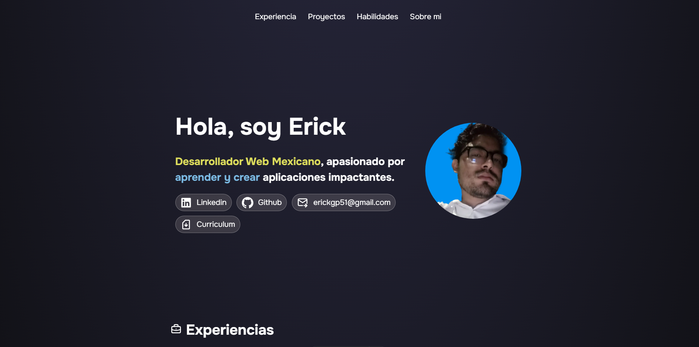

# Mi portafolio

>Al clonar este repositorio es necesario usar el siguiente comando para su correcto funcionamiento

```sh
npm install astro
```


[](https://portafolio-puce-mu.vercel.app)


## Portada de mi portafolio 

